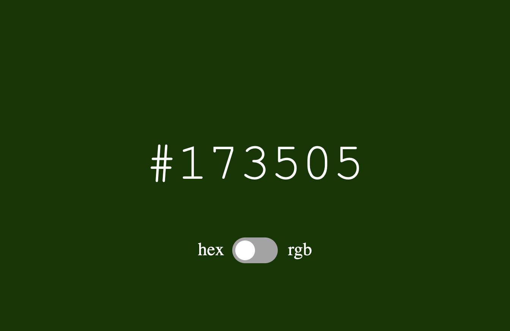

# HEX-RGB-clock
A simple web page that displays the current time as a hex or rgb color. 

You can interact with the website from [this link](https://htmlpreview.github.io/?https://github.com/darisoy/HEX-RGB-clock/blob/main/index.html) (Takes a minute or two to load the CSS and JS file).  

Perview of the web page:

